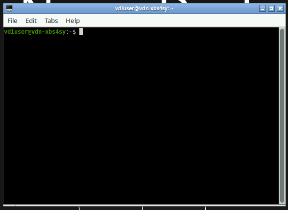

# Linux Command Line (CLI) Basics 

The Linux command line (also called a terminal or shell) is a text-based interface for interacting with your computer. Rather than clicking icons and menus, you type commands directly. For neuroimaging research, the command line is essential, a lot of computing software and tools will run primarily or exclusively from the terminal.

## Opening a terminal
Choose which operating system you are using 
=== "Linux"
    Press Ctrl + Alt + T, or search for "Terminal" in your applications menu.

=== "macOS"
    Open Finder → Applications → Utilities → Terminal, or press Cmd + Space and type Terminal.

=== "Windows (via WSL)"
    Install Windows Subsystem for Linux, then open Ubuntu from the Start menu. You can also install another program to emulate a Linux terminal such as [Gitbash](https://gitforwindows.org/).

=== "Neurodesk"
    Click the terminal icon in the Neurodesk desktop taskbar. [You can also see a quick tutorial here](../neurodesk/neurodesk_terminal.md)

### An example terminal on Neurodesk


### The prompt
When the terminal opens you will see a *prompt*, a line of text where you can type commands. It might look something like this:
```bash
username@hostname:~$
```
This *prompt* tells you four things:

- The username of the person running the command (before `@` symbol).
- The name of the computer running the command (after the `@` symbol).
- The `~` means you are currently in your *home directory*. You'll learn more about that in a moment. The home directory is the default location a terminal will start in.
- The `$` means that the prompt is ready to receive a command. Sometimes you might see a `#` instead of a `$`, this means that the next command will run with *root permissions* (more on that later).

**To run a command, type it at the prompt and press Enter.** The terminal will run the command and print any output directly below it, then show a new prompt ready for the next command.


!!! tip
    You don't need to type the `$` when following examples in tutorials, it just represents the prompt.

## Basic navigation
The Linux file system is organised as a tree of folders (called *directories*) and files. The folder at the base of the tree (`/`) is called the **root** directory.

A location within in the file system is given by specifying all of the directories needed to navigate to that location from the root directory, separated by `/`'s. This is called a *path*.  For example, the *path* to your `Documents` folder might be something like this:
```bash
/Users/Name/Documents/
```

There is a special directory on your computer called your *home directory*. It often has a path like `/Users/Name/`. It is the default location that terminals will start at. It is also given a special symbol for its path, `~`. The home directory is often the base of the tree for directories and files that you create, so it is convenient to use `~` to make paths shorter.

For example, the path to the Documents folder could also be specified like this:
```bash
~/Documents/
```

### Print your current location
```bash
$ pwd
```
`pwd` stands for *print working directory*. This prints the path of your current *working directory* (the directory you are in). Basically, this tells you where you *currently* are in the file tree. This path is also often denoted by `.`. So if you see a path starting with `./` it is a path from inside your current directory. 

### List files and directories
```bash
$ ls
```
`ls` stands for *list*. It will show you everything that is inside the current directory. 

We can provide additional options (called *flags*) to `ls` to have more information.
```bash
$ ls -l        # Long format — shows permissions, size, date
$ ls -a        # Show hidden files (files starting with a dot)
$ ls -lh       # Long format with human-readable file sizes
$ ls -la       # Combine: long format + hidden files
$ ls -lha      # Combine: long format + hidden files + human-readable file sizes
```

### Change directory
```bash
$ cd DirectoryPath
```
You can either provide a *relative path* or an *absolute path* to the directory. A *relative path* is the path from your current working directory to the new directory; however it will only work from the current location. An *absolute path* is the path from the root directory to the new directory; but this path will work from anywhere.

For example, if you are in the current working directory `/Users/Name/` to get to `/Documents` (a directory in `Name`) you can do either of the following:
```bash
$ cd Documents              # Uses relative path (only works at /Users/Name/)
$ cd /Users/Name/Documents  # Uses absolute path (will work anywhere)
```
Typically, using relative paths is good for moving up and down a small number of directories, whereas using the absolute path is more common when moving up/down a large number of directories and you know where you want to go.

There are additionally some special paths that will be useful to navigate around your filesystem.
```bash
$ cd ~         # Go to your home directory
$ cd ..        # Go up one level (parent directory)
$ cd -         # Go back to the previous directory
$ cd /         # Go to the root of the filesystem
```

!!! tip "Tab completion"
    Press Tab after typing part of a filename or directory name and the terminal will complete it automatically. If there are multiple matches, press Tab twice to see them all. This saves a lot of typing and prevents typos.


## Getting Help
Before going any further, you should know that almost every single command you will ever use has a manual on how to use it. If you forget how to do something the manual can help you. It will list all the different flags, options and order you need to use the command.
```bash
$ man ls          # Full manual for ls
$ ls --help       # Quick usage summary
```

## Working with directories and files

### Create a directory
```bash
$ mkdir new_directory
```
This will create a directory in your current location called `new_directory`. If you know you want to make a bunch of directories within each other, you can use the `-p` to make nested directories all in one go.
```bash
$ mkdir -p my_project/data/raw
```

### Create an empty file
```bash
$ touch notes.txt
```
This will create an empty `notes.txt` file with nothing inside it.

### Copy files and directories
Copying files uses the `cp` command. This command will always require at least two arguments, the path of the source file and the path of the destination. By default, `cp` will *not* copy the contents inside directories. You need to use the `-r` flag to recursively copy directory contents. 
```bash
$ cp source.txt destination.txt           # Copy a file
$ cp source.txt /path/to/other/folder/    # Copy into a different directory
$ cp -r my_folder/ backup_folder/         # Copy a directory (-r means recursive)
```


### Moving and renaming files and directories
The `mv` command is used for both moving and renaming. It works similar to `cp`.
```bash
$ mv oldname.txt newname.txt              # Rename a file
$ mv file.txt /path/to/other/folder/      # Move a file
$ mv my_folder/ /path/to/destination/     # Move a directory
```

### Delete files and directories
To delete a file or directory, use the `rm` command. However, use it carefully.

```bash
$ rm file.txt                  # Delete a file
$ rm -r my_folder/             # Delete a directory and everything inside it
```
!!! warning
    There is no recycle bin in the terminal! **Deleted files are gone permanently!** I'll say that again. *Deleted files are gone permanently*. Double-check your `rm` command before pressing Enter. Avoid `rm -rf` (force delete recursively) unless you are 100% certain of what you are deleting.


### Viewing file contents
There are a lot of different ways to view the contents of a file. The most common ones are `cat`, `less`, `head` and `tail`.

```bash
$ cat file.txt            # Print the whole file to the terminal
$ less file.txt           # View file page by page (press Q to quit)
$ head file.txt           # Show the first 10 lines
$ tail file.txt           # Show the last 10 lines
$ tail -f logfile.txt     # Follow a file in real time (useful for logs)
```

## Wildcards
Wildcards are special characters that match multiple filenames at once, saving you from typing every filename individually.

### `*` — match anything
`*` matches any number of characters (including none).

```bash
$ ls *.nii.gz                        # List all NIfTI files in current directory
$ ls sub-*                   # List everything starting with "sub-"
$ cp /data/sub-01/anat/*.nii.gz ./   # Copy all NIfTI files from a folder
$ rm *_temp.txt                      # Delete all files ending in _temp.txt
```

### `?` — match a single character
`?` matches exactly one character.

```bash
$ ls sub-0?.nii.gz      # Matches sub-01, sub-02 ... sub-09, but not sub-10
$ ls run-?_bold.nii.gz  # Matches run-1_bold, run-2_bold, etc.
```

### `[]` — match a set of characters
Square brackets match any one character from the set you specify.

```bash
$ ls sub-0[123].nii.gz        # Matches sub-01, sub-02, sub-03 only
$ ls sub-[0-9][0-9].nii.gz    # Matches sub-01 through sub-99
$ ls *.[st][hx]               # Matches .sh and .tx extensions
```

### Practical neuroimaging examples

```bash
# Copy all functional runs for one subject
$ cp sub-01/func/*_bold.nii.gz /data/processed/

# List all T1w images across all subjects
$ ls /data/sub-*/anat/*_T1w.nii.gz

# Delete all intermediate files ending in _temp
$ rm /data/sub-01/func/*_temp.nii.gz

# Count how many subjects you have
$ ls -d sub-*/ | wc -l
```

!!! warning
    Wildcards expand before the command runs. The command `rm *.nii.gz` deletes every matching file immediately. Always run `ls *.nii.gz` first to preview what a wildcard will match before using it with `rm` or `mv`.

## Searching for files

### Finding files by name
You can use the `find` command to search for files.
```bash
$ find . -name "sub01.nii"        # Search from current directory
$ find /data -name "*.nii.gz"             # Find all NIfTI files under /data
$ find . -type d -name "func"             # Find directories named "func"
$ find . -mtime -7                        # Files modified in the last 7 days
```
Here `-name`, `-type` and `-mtime` are various options for the `find` command. 

Reminder that the `.` means "start searching here" or "my current working directory". Replace it with any path to search elsewhere.

### Search inside files with `grep`
Use `grep` to search for text patterns inside files.
```bash
$ grep "error" logfile.txt                     # Find lines containing "error"
$ grep -i "warning" logfile.txt                # Case-insensitive search
$ grep -r "subject_id" /data/scripts/          # Search recursively in a directory
$ grep -n "TR" scan_params.txt                 # Show line numbers with matches
$ grep -v "skip" results.txt                   # Show lines that do NOT match
```


## Pipes and redirections

### Pipes `|`
A pipe sends the output of one command as input to another. This is useful if you want to chain commands one after another.

```bash
$ ls -l | less                       # Page through a long directory listing
$ cat subjects.txt | grep "sub-0"    # Filter a list of subjects
```

You can chain multiple pipes together:
```bash
$ cat logfile.txt | grep "error" | wc -l    # Count how many lines contain "error"
```
So this line passes the entire contents of `logfile.txt` into `grep`, where it looks for all the lines that contain the word `error`, then passes those lines to `wc` where it counts the number of lines it was passed.


!!! tip
    Here the `wc -l` command (word count) counts the number of lines in the input. If you want to count words you can use `wc -w`. 

### Redirections `>` and `>>`
Often when you are running a command or script, you want the output to be saved into a file instead of printing to the terminal. You can do this with `>` and `>>`. The difference between the two is that `>` will overwrite existing files whereas `>>` will append to an existing file.
```bash
$ ls -l > filelist.txt          # Save output (overwrites existing file)
$ ls -l >> filelist.txt         # Append output to existing file
```
!!! Note
    When you redirect the output, it will no longer print to the terminal, but directly to the new location. So it might appear like the command didn't do anything. So you will need to check the contents of the output file.


### Redirect errors `2>`
By default, computers often print errors to a different location to standard outputs. This 'location' is called `2`. 

| Number | Location |
|-----|--------|
| `0` | Standard Input (stdin)   - usually the keyboard |
| `1` | Standard Output (stdout) - usually the terminal |
| `2` | Standard Error (stderr)  - usually the terminal but for errors/warnings |


The `>` redirection works like `1>`, meaning "redirect the output of `1` (standard output) to a new location".

If we also want to redirect the error outputs, we can use `2>`.

```bash
$ ./my_script.sh > output.txt 2> errors.txt     # Save output and errors separately
$ ./my_script.sh > output.txt 2>&1              # Combine both into one file
```
In the second example, the `2>&1` means to redirect `2` to wherever `1` is being directed. So in this case, it means to save both to the same `output.txt` file.


## File permissions
Every file and directory has permissions controlling who can read, write, or execute it. You can view these permissions with `ls -l`
```bash
$ ls -l
```

Output:
```
-rwxr-xr-- 1 username group 4096 Mar 30 10:00 my_script.sh
drwxr-xr-x 2 username group 4096 Mar 30 09:00 my_folder
```

You will notice a collection of 10 characters and dashes. These tell you what the file type is, and what permissions different people have for that file. An example might be the following: 
```
- rwx r-x r--
│ │   │   └── Others: read (r) only
│ │   └────── Group: read (r) and execute (x)
│ └────────── Owner: read (r), write (w), execute (x)
└──────────── Type: - = file, d = directory
```
This means that this is a file (starts with `-`). Where the owner has full read, write and execute permissions. Members of that owner's 'group' can both read and execute the file (but not write/change the file). Everyone else (others), can only read the file.

### Changing permissions with `chmod`
The owner of a file can change its permissions with `chmod`. Here are a few examples:
```bash
$ chmod +x my_script.sh          # Make a script executable
$ chmod -w file.txt              # Remove write permission (protect a file)
$ chmod 755 my_script.sh         # rwxr-xr-x — owner full, others read/execute
$ chmod 644 file.txt             # rw-r--r-- — owner read/write, others read only
```
You can either change a single permission (`+` or `-` to add/remove a permission) for yourself, or use a three digit number to specify the owner, group and others permissions.

| Number | Permission| 
|---------|------------|
| `7` | rwx (read + write + execute)|
| `6` | rw- (read + write)|
| `5` |r-x (read + execute)|
| `4` |r-- (read only)|
| `0` |--- (no permissions)|

!!! tip
    New scripts often need `chmod +x script.sh` before you can run them.


## Text editors 
Sometimes you need to edit a file directly in the terminal, for example modifying a config file on a remote server.

### Nano (beginner friendly)
`nano` is a pretty easy to use text editor which will also show to the keyboard shortcuts on screen.

It is pretty easy to open a file in nano
```bash
$ nano myfile.txt
```
It will behave a little bit like a regular document, however you need to use your keyboard to navigate (you can't use your mouse).

Here are some of the `nano` shortcuts.

| Shortcut | Action |
|----------|--------|
| `Ctrl + O` | Save (write Out) |
| `Ctrl + X` | Exit |
| `Ctrl + W` | Search |
| `Ctrl + K` | Cut a line |
| `Ctrl + U` | Paste a line |
| `Ctrl + G` | Help |


### Vim (powerful, but steep learning curve)
`vim` is available on almost every Unix system. 
```bash
$ vim myfile.txt
```

`vim` has two modes: Normal (for navigation and commands) and Insert (for typing text). This makes it very unintuitive to use for beginners. However it becomes very powerful for editing text if you spend time getting to know it. It would need a whole separate tutorial on its own. But here are a few of the common commands

| Key     | Action |
|---------|--------|
| `i`     | Enter Insert mode (start typing) |
| `Esc`   | Return to Normal mode |
| `:w`    | Save |
| `:q`    | Quit |
| `:wq`   | Save and quit |
| `:q!`   | Quit without saving |
| `/text` | Search for "text" |
| `dd`    | Delete current line |
| `u`     | Undo |


!!! tip
    If you accidentally open vim and don't know how to exit, press `Esc` then type `:q!` and press Enter.


## Helpful additional commands
### History and shortcuts
```bash
$ history                  # Show previous commands
$ !!                       # Repeat the last command
$ !grep                    # Repeat the last command starting with "grep"
Ctrl + R                   # Search through command history interactively
Ctrl + C                   # Cancel a running command
Ctrl + L                   # Clear the terminal screen (same as `clear`)
Ctrl + A                   # Jump to start of line
Ctrl + E                   # Jump to end of line
```

### Disk usage
```bash
$ df -h                        # Show free disk space on all drives
$ du -sh /data/subs/           # Show total size of a directory
$ du -sh /data/*/              # Show size of each subdirectory
```

### Processes
```bash
$ top                      # Live view of running processes (press Q to quit)
$ htop                     # Nicer version of top (may need installing)
$ ps aux | grep my_script  # Check if a script is running
$ kill 12345               # Stop a process by its ID
```