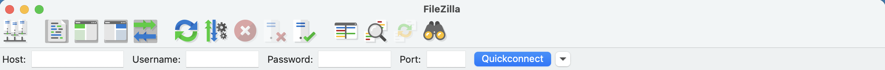
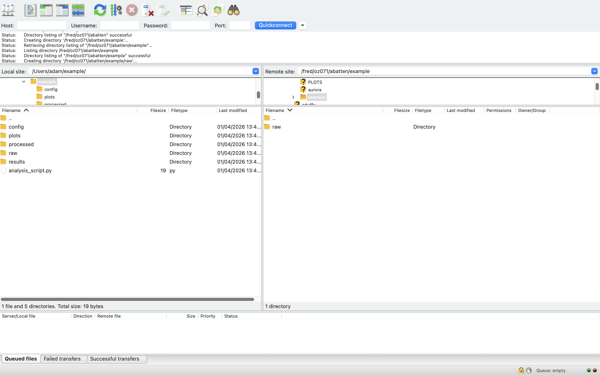
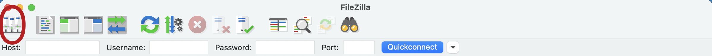
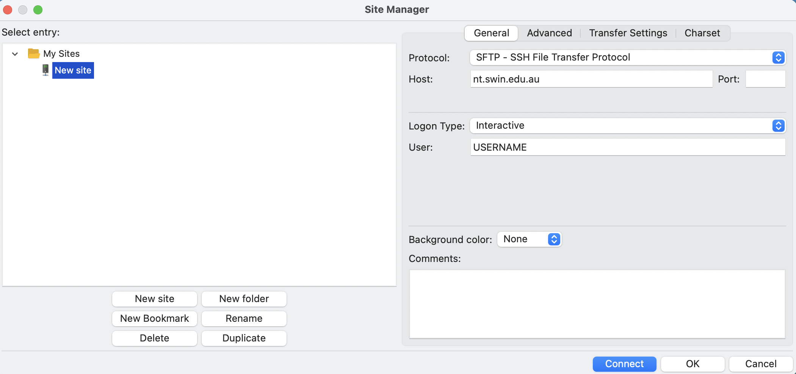

# Navigating the Supercomputer and Downloading Project Data

Files can be downloaded and uploaded to and from the supercomputer to a local computer, if the user has permission to do so. To achieve this, OzSTAR/NT has [recommendations on downloading and uploading project data](https://supercomputing.swin.edu.au/docs/1-getting_started/file-transfer.html). However if you are not confident in using a terminal, a graphical interface can be used to help facilitate data and file transfer over SSH.

One such graphical interface we recommend is [FileZilla](https://filezilla-project.org/). You can [follow the official FileZilla tutorial](https://wiki.filezilla-project.org/FileZilla_Client_Tutorial_(en)) on their website, or follow our one below for specifc OzSTAR/NT usage. 

!!! note
    If you haven't already [created an OzSTAR/NT account](./create_ozstar_account.md), you'll need to create one first and [join an OzSTAR/NT project](./join_an_ozstar_project.md) to get access to the data.

## FileZilla

### Installation
You can [download FileZilla here](https://filezilla-project.org/). Make sure to download the **FileZilla Client** not the FileZilla Server. It is available for both Windows and MacOS computers. Once installed, FileZilla can be used to access the project data in one of two ways:

- Quickconnect (for infrequent connections)
- Site Manager (for frequent connections)


### Quickconnect


In the Quickconnect toolbar, add the following information:

- In Host type "nt.swin.edu.au" to connect to NT or "ozstar.swin.edu.au" to connect to OzSTAR.
- In Username type your OzSTAR/NT account username.
- In Password type your OzSTAR/NT account password.
- In Port type "22" (standard SSH port)
- Click "Quickconnect" 

The first time you connect to the Supercomputer via FileZilla (and via the terminal), the Supercomputer will request to confirm a unique identifier that OzSTAR/NT uses to identify your local computer every time a connection is made, **select "YES"**. Once a connection is made, your window should look something like this:



The files on your local computer will be shown on the left and files on the supercomputer will be shown on the right. Below is a labelled diagram of everything you can see on the screen.


You can transfer files between local computer to the supercomputer by drag and drop from the left and right sides of the screen (the blue and yellow regions in the above image).

To locate your data, change the Remote Site (top of yellow region) to `/fred/ozXXX/` where `ozXXX` is your OzSTAR/NT project number.

!!! warning
    Files can be dragged between the local and supercomputers by dragging files from the left side of the screen to the right side of the screen (and vice versa). **Dragging files from one side to the other side only copies files between the computers and does not move them**. 

    The location of files on the Supercomputer can be changed using FileZilla, by dragging files from one place to another (on the right side of the screen). **Dragging files from one location to another on the Supercomputer will move them instead of copying them**, therefore users should be careful not to accidently drag files or directories to incorrect places.


### Using site manager
If you are reguarly connecting to OzSTAR/NT, you can save your connection to the site manager, so it is quicker to connect future times.


1. Click **Site Manager** in the FileZilla toolbar (the upper-left icon as circled in the image below).


2. The **Site Manager** window will appear asking to set-up the site (the computer you want to connect
too).


When first setting this up, navigate to "New Site" on the lower left hand side, and add the following information:

- From the protocol drop-down box select "SFTP - SSH File Transfer Protocol".
- Type "nt.swin.edu.au" into the Host window.
- Select Logon Type as "Interactive".
- In the User window, type your OzSTAR/NT username.
- Click "Connect".
- Enter your OzSTAR/NT password
- Select "Yes" when if you are asked about confirming a unique identifier (see Quickconnect)

You can also take this opportunity to rename the site to a sensible name, such as "NT" or "OzSTAR" by clicking on **Site Manager > 'New Site' > Rename**. You can save multiple Hosts (remote computers), and to connect to any of them just click on **Site Manager > Desired Remote Computer > Connect**.

### Using SSH keys with site manager
If you have previously [set up SSH keys](../basics/ssh_basics.md#ssh-keys---passwordless-login) to connect to OzSTAR/NT without a password, you can do the same in site manager.

- From the protocol drop-down box select "SFTP - SSH File Transfer Protocol".
- Type "nt.swin.edu.au" into the Host window.
- Select Logon Type as "Key File".
- In the User window, type your OzSTAR/NT username.
- In Key File type the full path to your *private key*. It will be in your `.ssh` folder. If you [set up SSH keys using this method](../basics/ssh_basics.md#ssh-keys---passwordless-login), then a common place for your private key is `/Users/<username>/.ssh/id_ed25519` 
- Click "Connect".


## Navigating using terminal/command Line
If you aren't confident in navigating directories via a terminal, you might want to read our [linux command line basics](../basics/linux_command_line_basics.md) tutorial first.

If you are confident to navigate via a terminal or command line, you can access your data via SSH: 
```bash
$ ssh username@nt.swin.edu.au       # To access NT
$ ssh username@ozstar.swin.edu.au   # To access OzSTAR
```
Then your project data is located in
```bash
$ cd /fred/ozXXX/raw
```
where the `ozXXX` is your OzSTAR project number.

### Symlink project data to home directory
We recommend creating a symlink (a shortcut) from your home directory to your project data directory.
```bash
$ cd ~                        # Make sure you are in your home directory
$ ln -s /fred/ozXXX/ ozXXX    # ozXXX is your project number
```
You should now find a new file in your home directory called `ozXXX`. You can `$ cd ozXXX` to get directly to your project data.