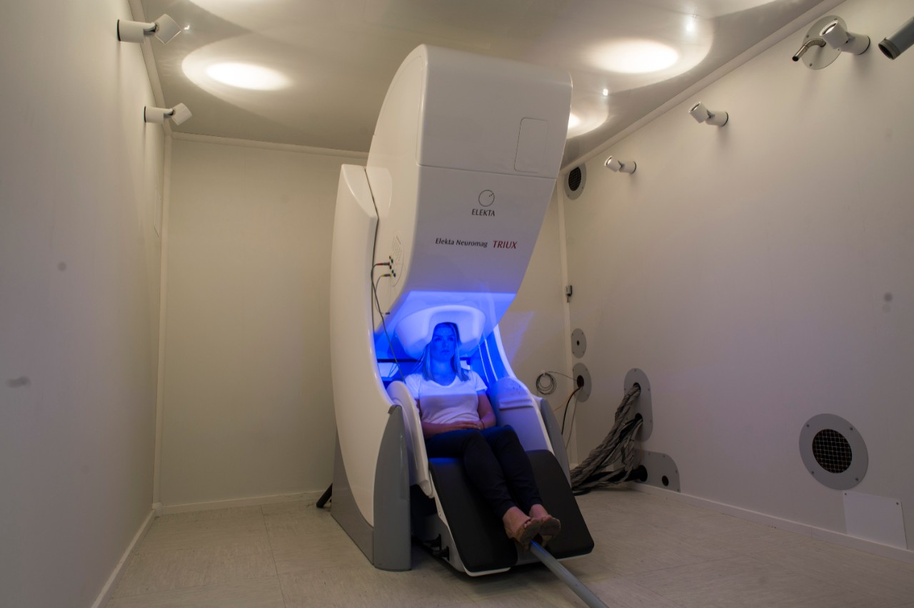

# MEG Overview & Specs

MEG’s temporal precision is important as it lets us investigate single, rapid processes. This is crucial when we’re looking at the timing of thousands of coordinated processes.

These steps must occur in exactly the right sequence for normal brain function.

Compare this with how a car engine’s fuel injection system works.

A car engine needs to fire each cylinder rapidly. The fuel injection system does this at a precise moment, relative to the other cylinders. When this timing degrades, severe damage can result.

The human brain is like an engine with hundreds of thousands of cylinders, all in harmony with one another.

Our MEG scanner provides a unique means to examine changes in neural activity and timing.

These could underpin conditions such as:

- epilepsy
- traumatic brain injury
- dementia
- stroke
- anxiety
- depression.

In addition, MEG promises to give new insights into developmental conditions like:

- autism
- attention deficit hyperactivity disorder (ADHD).

